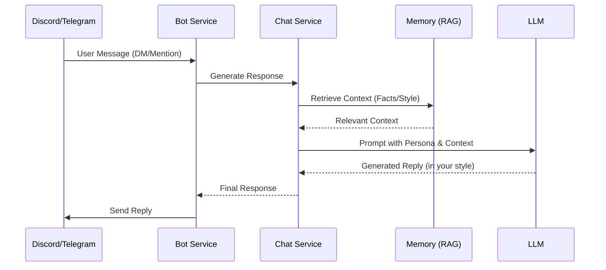

# 🧠 Chirag Clone - Personal Digital Twin

**I am Chirag's digital brain.** A continuously learning AI system that evolves to mimic my personality, knowledge, and communication style.

---

## 🛠️ Tech Stack

### Frontend

- **Framework**: React 18 + Vite
- **Styling**: Tailwind CSS (Glassmorphism design)
- **Icons**: Lucide React
- **Visualization**: Recharts
- **State/Animations**: Framer Motion

### Backend

- **Framework**: FastAPI (Python 3.11)
- **AI/LLM**: Google Gemini 2.0 Flash (Primary), OpenAI (Fallback)
- **Vector DB**: ChromaDB (Local persistence)
- **Task Management**: AsyncIO + threading
- **PDF Processing**: PyMuPDF

### DevOps & Infrastructure

- **Containerization**: Docker + Docker Compose
- **Server**: Uvicorn (ASGI)
- **Environment**: Dotenv (.env) management

---

## ✨ Key Features

### 🏛️ extensive Training Center (`/training`)

Teach your clone how to be you through multiple modalities:

- **Chat Uploads**: Learn from your real conversations (WhatsApp, Instagram, Discord)
- **Train by Chatting**: Interactive interview mode where the bot learns from your answers
- **Documents**: Upload PDFs, resumes, and text files for RAG-based knowledge
- **Journal**: Feed your thoughts and daily reflections
- **Facts**: Manually add key facts about yourself

### 📊 Analytics Dashboard (`/`)

Visual insights into your clone's development:

- **Personality Completion Ring**: Track how "complete" your clone is
- **Data Sources**: See where your clone is learning from
- **Learning Curve**: Track progress over time
- **Knowledge Metrics**: Stats on facts, quirks, and emoji usage

### 🤖 Social Autopilot (`/autopilot`)

Let your clone handle your socials when you're away:

- **Discord Bot**: Auto-reply to DMs and mentions
- **Telegram Bot**: Smart auto-responses
- **Control Panel**: Start/stop bots and view reply logs in real-time

### Other Capabilities

- **👁️ Vision**: Send images and I'll react like you would
- **🔍 Web Search**: Real-time information access
- **🛡️ Robust Security**: Rate limiting, localized data, PIN protection

---

## 🏗️ Architecture

### System Overview

```mermaid
graph TD
    User[You] -->|Web UI| Frontend[React + Vite]
    
    subgraph "Frontend Layer"
        Frontend --> Dashboard[Analytics Dashboard]
        Frontend --> Training[Training Center]
        Frontend --> Autopilot[Autopilot Control]
        Frontend --> Chat[Chat Interface]
    end
    
    Frontend -->|API/WebSocket| Backend[FastAPI Backend]
    
    subgraph "Backend Services"
        Backend --> Router[API Router]
        Router --> ChatService[Chat Service]
        Router --> TrainingService[Training Service]
        Router --> AutopilotService[Autopilot Service]
        
        ChatService --> Brain[LLM (Gemini/OpenAI)]
        ChatService --> Memory[ChromaDB Vector Store]
        ChatService --> Personality[Personality Profile]
        
        AutopilotService --> Discord[Discord Bot]
        AutopilotService --> Telegram[Telegram Bot]
    end
```

### Autopilot Workflow



---

## 🚀 Quick Start Guide

### 1. Prerequisites

- Python 3.11+
- Node.js 18+
- [Google Gemini API Key](https://makersuite.google.com/app/apikey)

### 2. Setup (Local Development)

#### Backend Setup

```bash
# Activate venv:
# Windows: venv\Scripts\activate
# Linux/Mac: source venv/bin/activate

cd backend
python -m venv venv
# Back to root for installation
cd ..
pip install -r requirements.txt
cp .env.example .env  # Configure your keys in .env
```

#### Frontend Setup

```bash
cd frontend-react
npm install
```

### 3. Running the App

**Terminal 1 (Backend):**

```bash
cd backend
python -m uvicorn main:app --reload --port 8000
```

**Terminal 2 (Frontend):**

```bash
cd frontend-react
npm run dev
```

Open **<http://localhost:5173>** (or the port shown in terminal) to access the UI.

---

## 🐳 Docker Deployment

Run the entire stack with a single command.

### Option A: Docker Compose (Recommended)

This sets up optimized containers for backend and frontend.

```bash
# 1. Configure environment
cp .env.example .env
# Edit .env with your API keys

# 2. Start services
docker-compose up -d --build

# 3. View logs
docker-compose logs -f
```

Access app at `http://localhost:5173` (Frontend) and `http://localhost:8000` (Backend API).

### 🧪 Running Tests

To verify the installation and backend logic:

```bash
# Install dependencies from root
pip install -r requirements.txt
pip install pytest httpx

cd backend
python -m pytest tests/test_main.py
```

### Option B: Manual Docker Run

```bash
# Build image
docker build -t chirag-clone .

# Run container
docker run -p 8000:8000 --env-file backend/.env chirag-clone
```

---

## 🔧 Bot Configuration

To enable **Social Autopilot**, you need to configure bot tokens in your `.env` file:

### Discord Bot Setup

1. Go to [Discord Developer Portal](https://discord.com/developers/applications)
2. Create a New Application -> Bot
3. Enable **Message Content Intent** under Privileges
4. Copy Token to `.env`: `DISCORD_BOT_TOKEN=your_token`
5. Invite bot to server using OAuth2 URL Generator (scopes: `bot`, permissions: `Read Messages`, `Send Messages`)

### Telegram Bot Setup

1. Message [@BotFather](https://t.me/BotFather) on Telegram
2. Send `/newbot` and follow instructions
3. Copy Token to `.env`: `TELEGRAM_BOT_TOKEN=your_token`
4. Start a chat with your new bot

---

## 📁 Project Structure

```text
Chirag-clone/
├── .env                        # Environment Config (Secrets)
├── .env.example                # Config Template
├── requirements.txt            # Python Dependencies
├── docker-compose.yml          # Container Orchestration
├── Dockerfile                  # Production Build Definition
├── CHANGELOG.md                # Project History
│
├── backend/
│   ├── main.py                 # FastAPI Application Entry Point
│   ├── config.py               # Configuration Settings
│   │
│   ├── services/               # Core Business Logic
│   │   ├── chat_service.py     # Core chat logic
│   │   ├── llm_service.py      # Gemma/Gemini Integration
│   │   └── ...
│   │
│   ├── parsers/                # Chat Log Parsers
│   └── data/                   # Local Storage (Vector DB, Identity)
│
└── frontend-react/
    ├── src/
    │   ├── components/
    │   └── App.tsx
    └── package.json
```

---

## 🛡️ Security & Privacy

- **Local-First**: Your personality profile and vector data are stored locally in `backend/data/`.
- **PIN Protection**: The Training Center is protected by a PIN (default: `1234`) to prevent unauthorized changes.
- **Environment Variables**: API keys are strictly managed via `.env` and never committed.
