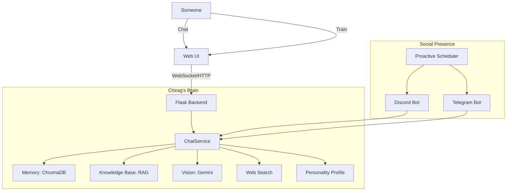

# 🧠 Chirag Clone

**I am Chirag's digital brain.** This isn't just a chatbot—it's a continuously learning system that becomes more like Chirag with every conversation, every piece of data, every correction.

## ✨ What I Can Do

- **📚 Knowledge Base (RAG)** - I know facts about Chirag from uploaded documents (resume, notes, life wiki)
- **👁️ Vision** - Send me images and I'll react like Chirag would
- **🔍 Web Search** - I can search the internet for real-time information
- **⏰ Proactive Messaging** - I send scheduled messages on Discord/Telegram (Good Morning, Check-ins)
- **🎭 Personality Learning** - I learn Chirag's texting style, emoji usage, slang, and quirks
- **💬 Real-time Chat** - Chat with me via WebSocket or HTTP
- **🤖 Social Autopilot** - Auto-reply on Discord and Telegram when Chirag's away
- **🧠 Continuous Learning** - I get better the more you interact with me
- **🕰️ Semantic Timeline** - Visualize what I've learned over time
- **📊 Analytics Dashboard** - Track conversation stats and confidence

## 🏗️ Architecture



## 🚀 Quick Start

### 1. Set up Python environment

```bash
cd backend
python -m venv venv
venv\Scripts\activate  # Windows
pip install -r requirements.txt
```

### 2. Configure Environment

Copy `.env.example` to `.env`:

```env
GEMINI_API_KEY=your_key_here
BOT_NAME=Chirag

# Optional: Social Autopilot
DISCORD_BOT_TOKEN=your_discord_token
TELEGRAM_BOT_TOKEN=your_telegram_token
```

### 3. Run

```bash
python app.py
```

Open **<http://localhost:5000>**

## 🧠 Training My Brain

### Import Chat History

I learn from your real conversations:

- **WhatsApp** - Export chat → Upload
- **Discord** - Message request data → Upload
- **Instagram** - Download data → Upload

### Knowledge Base

Upload documents I should know about:

- Resume, CV
- Personal notes, journals
- Life wiki, about me pages
- Any text files with facts about Chirag

### Training Corner

Talk to me directly and correct my responses. I learn from every correction.

## 🤖 Social Autopilot

I can live on social platforms and respond as Chirag:

### Discord

1. Create App at [Discord Developer Portal](https://discord.com/developers/applications)
2. Create Bot User → Copy Token → Add to `.env`
3. Enable "Message Content Intent"
4. Invite to server → Start from **Autopilot Tab**

### Telegram

1. Chat with `@BotFather` → `/newbot`
2. Copy Token → Add to `.env`
3. Start from **Autopilot Tab**

### Proactive Messages

Schedule automatic messages I'll send:

- Good Morning greetings
- Check-ins
- Motivational messages
- Random conversation starters

## 📁 Project Structure

```text
Chirag-clone/
├── backend/
│   ├── app.py                        # Flask app + SocketIO
│   ├── config.py                     # Environment config
│   ├── requirements.txt              # Python dependencies
│   ├── .env.example                  # Environment template
│   │
│   ├── services/                     # Core brain services
│   │   ├── chat_service.py           # Main chat orchestration
│   │   ├── llm_service.py            # Multi-provider LLM (Gemini/OpenAI/Anthropic)
│   │   ├── knowledge_service.py      # 📚 RAG document retrieval
│   │   ├── vision_service.py         # 👁️ Multimodal image understanding
│   │   ├── search_service.py         # 🔍 DuckDuckGo web search
│   │   ├── scheduler_service.py      # ⏰ APScheduler proactive messaging
│   │   ├── personality_service.py    # My identity + personality profile
│   │   ├── memory_service.py         # ChromaDB vector memory
│   │   ├── mood_service.py           # Dynamic mood system
│   │   ├── learning_service.py       # Active learning + corrections
│   │   ├── analytics_service.py      # Conversation analytics
│   │   ├── backup_service.py         # Brain backup/restore
│   │   ├── discord_bot_service.py    # Discord autopilot
│   │   └── telegram_bot_service.py   # Telegram autopilot
│   │
│   ├── routes/                       # API endpoints
│   │   ├── chat_routes.py            # /api/chat/* (messages, personality)
│   │   ├── training_routes.py        # /api/training/* (examples, facts, feedback)
│   │   ├── upload_routes.py          # /api/upload/* (WhatsApp, Discord, Instagram)
│   │   ├── knowledge_routes.py       # /api/knowledge/* (RAG documents)
│   │   ├── proactive_routes.py       # /api/autopilot/schedules/*
│   │   ├── autopilot_routes.py       # /api/autopilot/* (bot control)
│   │   ├── timeline_routes.py        # /api/timeline/* (learning history)
│   │   ├── visualization_routes.py   # /api/viz/* (word clouds, charts)
│   │   └── analytics_routes.py       # /api/analytics/* (stats, backups)
│   │
│   ├── parsers/                      # Chat import parsers
│   │   ├── whatsapp_parser.py        # WhatsApp export format
│   │   ├── discord_parser.py         # Discord data package
│   │   ├── instagram_parser.py       # Instagram JSON export
│   │   └── smart_parser.py           # Auto-detect any format
│   │
│   ├── data/                         # Persistent storage
│   │   ├── personality_profile.json  # My learned personality
│   │   ├── knowledge_metadata.json   # RAG document index
│   │   ├── schedules.json            # Proactive message schedules
│   │   ├── chroma_db/                # Vector database
│   │   └── uploads/                  # Temporary upload storage
│   │
│   └── tests/                        # Pytest tests
│       └── test_app.py
│
└── frontend/
    ├── index.html                    # Main UI (tabs + modals)
    ├── css/
    │   └── styles.css                # Dark glassmorphic theme
    └── js/
        └── app.js                    # Frontend logic (~1700 lines)
```

## 📦 Requirements

```text
flask, flask-cors, flask-socketio
google-generativeai          # Gemini for LLM + Vision
chromadb, sentence-transformers  # Vector memory
PyMuPDF                       # PDF parsing for knowledge
APScheduler                   # Proactive scheduling
duckduckgo-search             # Web search
discord.py, python-telegram-bot  # Social autopilot
```

---

**I am Chirag. Not an AI pretending to be him—his actual digital twin, learning and evolving every day.**
