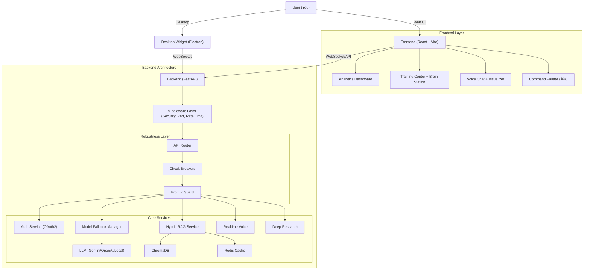
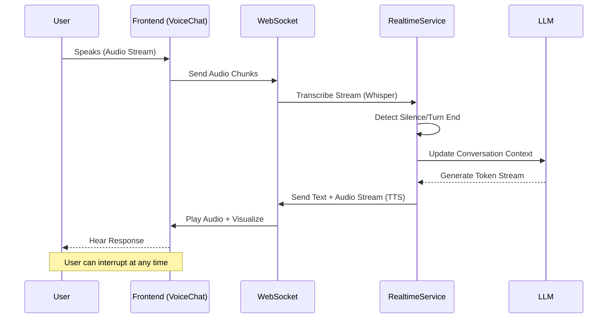

# 🧠 Chirag Clone - Personal Digital Twin


**I am Chirag's digital brain.** A continuously learning AI system that evolves to mimic my personality, knowledge, and communication style.

---

## 🛠️ Tech Stack

### Frontend

- **Framework**: React 19 + Vite
- **Styling**: Tailwind CSS (Glassmorphism design)
- **Icons**: Lucide React
- **3D Avatar**: Three.js + React Three Fiber
- **Visualization**: Recharts + Web Audio API
- **State/Animations**: Framer Motion
- **Testing**: Vitest + Playwright E2E

### Backend

- **Framework**: FastAPI (Python 3.11)
- **AI/LLM**: Google Gemini 2.0 Flash (Primary), OpenAI (Fallback)
- **Robustness**: Circuit Breakers + Rate Limiting + Model Fallback
- **Vector DB**: ChromaDB (Local persistence)
- **Real-Time**: WebSockets for Voice & Vision
- **Auth**: OAuth2 (Google/GitHub) + JWT + Admin Access Control
- **Task Management**: AsyncIO + APScheduler
- **PDF/Web Processing**: PyMuPDF + BeautifulSoup

### Security
- **Protection**: Prompt Guard + Content Security Policy (CSP)
- **Validation**: Pydantic v2 Strict Models


### Desktop Widget

- **Framework**: Electron
- **Features**: Floating window, screen capture (Eye Mode), global shortcuts

### DevOps & Infrastructure

- **Containerization**: Docker + Docker Compose (v2.3)
- **Server**: Uvicorn (ASGI)
- **Environment**: Dotenv (.env) management
- **Linting**: Pre-commit hooks (Black, Prettier, ESLint)

---

## ✨ Key Features

### 🔐 Security & Auth (v2.6)

- **OAuth2 Login**: Secure Google and GitHub social login flows.
- **Admin Access Control**: Training center restricted to authorized admins (`chiragns12@gmail.com`).
- **JWT Authentication**: Stateless, secure interactions.

### 🎙️ Duplex Voice (v2.6)

- **Barge-in Support**: Interrupt the bot mid-sentence naturally.
- **VAD Integration**: Intelligent Voice Activity Detection using WebRTC.

### 🛡️ Production Grade (v2.5)

- **Circuit Breakers**: Prevents cascading failures when APIs (OpenAI/ElevenLabs) are down.
- **Hybrid RAG**: Combines Semantic Search (Vector) + Keyword Search (BM25) with Reciprocal Rank Fusion.
- **Prompt Guard**: 5-level threat detection against prompt injection and jailbreaks.
- **Model Fallback**: Automatic failover (Gemini → GPT-4o → Local Llama) to ensure 24/7 uptime.

### 🌟 Advanced Intelligence (v2.4)

- **Deep Research**: Autonomous multi-step web research with source citation.
- **Rewind Memory**: Temporal screen recording analysis ("What was I looking at?").
- **Local Voice**: Offline-first TTS/STT with `faster-whisper` and `piper-tts`.
- **Command Palette (⌘K)**: Quick navigation and actions.

### 🎙️ Real-Time Voice Conversation (`/chat`)

**NEW in v2.3!** Talk to your clone naturally with ultra-low latency.

- **WebSocket Streaming**: Bidirectional audio streaming for instant responses.
- **Visualizer**: Real-time frequency bars (Orb/Wave modes) reacting to your voice.
- **Interruption**: Speak anytime to interrupt the bot, just like a real call.
- **Turn-taking**: Smart silence detection to know when you've finished speaking.

### 👁️ Desktop Vision "Eye Mode"

**NEW in v2.3!** Your clone sees what you see.

- **Screen Awareness**: Toggle "Eye Mode" in the desktop widget.
- **Proactive Suggestions**: The bot watches your active window and offers relevant tips.
- **Privacy-First**: Only captures the active window, never the full desktop.

### 🧠 Brain Station (`/training`)

**NEW in v2.3!** Central command for knowledge management.

- **Knowledge Graph**: Interactive 3D visualization of your clone's memory.
- **Drag-and-Drop**: Upload PDFs, text files, and markdown notes.
- **URL Ingestion**: Feed it web pages to learn from instantly.
- **Semantic Search**: Find any fact or document with natural language queries.

### 🏛️ Training Center

Teach your clone how to be you:

- **Chat Uploads**: Learn from WhatsApp, Instagram, Discord archives.
- **Interactive Training**: "Interview mode" where the bot asks you questions.
- **Journal**: Daily thought recording and reflection.
- **Facts**: Manual entry for key personal details.

### 🤖 Social Autopilot (`/autopilot`)

Handle your socials while you sleep:

- **Discord/Telegram**: Smart auto-replies to DMs.
- **Twitter/LinkedIn**: Draft tweets and professional replies in your style.
- **Gmail**: Voice-to-email drafting.
- **Review Workflow**: Nothing is posted without your approval.

---

## 🏗️ Architecture

### System Overview



### Real-Time Voice Flow



---

## 🚀 Quick Start Guide

### 1. Prerequisites

- Docker Desktop installed
- [Gemini API Key](https://makersuite.google.com/app/apikey)
- [ElevenLabs API Key](https://elevenlabs.io) (for voice)

### 2. Setup & Run (Recommended)

One command to start everything:

```bash
# 1. Clone & Config
git clone https://github.com/ChiragNSundar/Chirag-clone.git
cd Chirag-clone
cp .env.example .env

# 2. Add API Keys to .env
# GEMINI_API_KEY=...
# ELEVENLABS_API_KEY=...

# 3. Launch
docker-compose up -d --build
```

- **Frontend**: <http://localhost:5173>
- **Backend API**: <http://localhost:8000>

### 3. Desktop Widget (Optional)

For the "Eye Mode" feature:

```bash
cd desktop-widget
npm install
npm start
```

---

## 📁 Project Structure

```text
Chirag-clone/
├── .env                        # Environment Config (Secrets)
├── .pre-commit-config.yaml     # Linting Config (NEW)
├── pyproject.toml              # Python Config (NEW)
├── requirements.txt            # Python Dependencies
├── docker-compose.yml          # Container Orchestration (Redis + Chroma + App)
├── Dockerfile                  # Production Build Definition
├── CHANGELOG.md                # Project History
├── README.md                   # Documentation
│
├── backend/
│   ├── main.py                 # FastAPI Application Entry Point (HTTP + WebSocket)
│   ├── config.py               # Configuration Settings
│   ├── gunicorn.conf.py        # Gunicorn Config
│   │
│   ├── routes/                 # API Routes (NEW)
│   │   └── auth.py             # OAuth2 Routes
│   │
│   ├── services/                   # Core Business Logic
│   │   ├── __init__.py
│   │   ├── accuracy_service.py     # Verification Logic
│   │   ├── active_learning_service.py # Proactive Questioning
│   │   ├── analytics_service.py    # Dashboard Metrics
│   │   ├── async_job_service.py    # Background Tasks
│   │   ├── auth_service.py         # OAuth2 & JWT Logic (NEW)
│   │   ├── avatar_service.py       # 3D Avatar Logic
│   │   ├── backup_service.py       # Data Backup
│   │   ├── cache_service.py        # Redis/Local Cache
│   │   ├── calendar_service.py     # Google Calendar Integration
│   │   ├── circuit_breaker.py      # Fault Tolerance (NEW)
│   │   ├── chat_service.py         # Main Conversation Logic
│   │   ├── conversation_analytics_service.py # Topic/Heatmap Analysis
│   │   ├── core_memory_service.py  # Long-term Memory Summarization
│   │   ├── creative_service.py     # Dreams/Poems/Stories Engine
│   │   ├── deep_research.py        # Autonomous Research Agent (NEW)
│   │   ├── discord_bot_service.py  # Discord Integration
│   │   ├── emotion_service.py      # Sentiment Analysis
│   │   ├── gmail_bot_service.py    # Gmail Integration
│   │   ├── hybrid_rag.py           # BM25 + Semantic Search (NEW)
│   │   ├── knowledge_service.py    # RAG/Document/Brain Station
│   │   ├── learning_service.py     # Training Logic
│   │   ├── linkedin_bot_service.py # LinkedIn Integration
│   │   ├── llm_service.py          # Gemini/OpenAI Wrapper
│   │   ├── logger.py               # Structured Logging
│   │   ├── memory_search_service.py # Advanced Vector Search
│   │   ├── memory_service.py       # Vector DB Wrapper
│   │   ├── middleware.py           # Legacy Middleware
│   │   ├── model_fallback.py       # LLM Cascade Fallback (NEW)
│   │   ├── mood_service.py         # Emotional State
│   │   ├── personality_history_service.py # Personality Drift Tracking
│   │   ├── personality_service.py  # Identity Management
│   │   ├── prompt_guard.py         # Injection Protection (NEW)
│   │   ├── rate_limiter.py         # API Throttling
│   │   ├── realtime_voice_service.py # WebSocket Visualizer/Voice
│   │   ├── rewind_service.py       # Screen Memory (NEW)
│   │   ├── scheduler_service.py    # Cron Jobs
│   │   ├── search_service.py       # Web Search
│   │   ├── telegram_bot_service.py # Telegram Integration
│   │   ├── thinking_service.py     # Recursive Thinking (CoT)
│   │   ├── twitter_bot_service.py  # Twitter/X Integration
│   │   ├── vision_service.py       # Image/Screen Analysis
│   │   ├── voice_service.py        # TTS/STT (ElevenLabs/Whisper)
│   │   └── whatsapp_bot_service.py # WhatsApp Integration
│   │
│   ├── middleware/                 # Middleware Layer
│   │   └── security.py             # CSP & Sanitization (NEW)
│   │
│   ├── models/
│   │   └── validation.py           # Pydantic v2 Models (NEW)
│   │
│   ├── migrations/                 # Alembic Database Migrations (NEW)
│   │   └── versions/
│   │
│   ├── parsers/                    # Chat Log Parsers
│   │   ├── __init__.py
│   │   ├── discord_parser.py       # Discord JSON Parser
│   │   ├── instagram_parser.py     # Instagram JSON Parser
│   │   ├── smart_parser.py         # Auto-format Detector
│   │   └── whatsapp_parser.py      # WhatsApp Text Parser
│   │
│   ├── tests/                      # Test Suite
│   │   ├── test_main.py            # API Tests
│   │   ├── test_integration.py     # E2E Tests
│   │   └── ...
│   │
│   └── data/                       # Local Storage
│       ├── chroma_db/              # Vector Database
│       ├── knowledge/              # PDFs & Docs (Brain Station)
│       └── personality_profile.json # Learned Traits
│
├── frontend-react/
│   ├── index.html
│   ├── package.json
│   ├── postcss.config.js
│   ├── tailwind.config.js
│   ├── tsconfig.json
├── .prettierrc                 # Formatting Config (NEW)
│   ├── vite.config.ts
│   │
│   └── src/
│       ├── main.tsx                # React Entry Point
│       ├── index.css               # Global Styles/Tailwind
│       ├── App.tsx                 # Routing & Layout
│       │
│       ├── components/             # React Components
│       │   ├── AudioVisualizer.tsx # Web Audio API Viz
│       │   ├── AutopilotPage.tsx   # Bot Control Dashboard
│       │   ├── Avatar3D.tsx        # 3D Avatar with Lip-Sync
│       │   ├── ChatInterface.tsx   # Main Chat UI + Avatar
│       │   ├── CommandPalette.tsx  # Quick Actions (NEW)
│       │   ├── Dashboard.tsx       # Analytics Home
│       │   ├── Layout.tsx          # Navigation Wrapper
│       │   ├── LoginPage.tsx       # Social Login (NEW)
│       │   ├── MemoryGraph.tsx     # Interactive Knowledge Graph
│       │   ├── ProfilePage.tsx     # Bot Profile Settings
│       │   ├── SettingsPanel.tsx   # Preferences & Theme (NEW)
│       │   ├── ThinkingBubble.tsx  # CoT Visualization
│       │   ├── TrainingCenter.tsx  # Brain Station + Training
│       │   └── VoiceChat.tsx       # Live Voice Streaming
│       │
│       ├── utils/
│       │   └── lazyLoad.tsx        # Lazy Loading HOCs (NEW)
│       │
│       ├── e2e/                    # End-to-End Tests (NEW)
│       │   └── app.spec.ts         # Playwright Spec
│       │
│       ├── services/
│       │   └── api.ts              # API Client
│       │
│       └── assets/                 # Static Assets
│
├── desktop-widget/                 # Electron Desktop App
│   ├── package.json                # Electron Dependencies
│   ├── main.js                     # Main Process (Screen Capture)
│   ├── preload.js                  # Secure IPC Bridge
│   ├── index.html                  # Widget UI
│   ├── renderer.js                 # Front Logic (Eye Mode)
│   └── styles.css                  # Glassmorphism Theme
```

## � API Reference

### Health & System

- `GET /api/health`: System status, version, and service health checks (supports `?detailed=true`).
- `GET /api/system/metrics`: Cache stats, memory usage, connection pool status.
- `GET /api/profile`: Get the bot's personality profile and stats.

### 🧠 Brain Station (Knowledge)

- `GET /api/knowledge/stats`: Knowledge base statistics.
- `GET /api/knowledge/documents`: List indexed documents.
- `POST /api/knowledge/upload`: Upload PDF/TXT/MD files.
- `POST /api/knowledge/text`: Ingest raw text facts.
- `POST /api/knowledge/url`: Ingest content from a URL.
- `POST /api/knowledge/query`: Semantic search against the knowledge base.
- `DELETE /api/knowledge/document/{doc_id}`: Remove a document.

### 🎙️ Real-Time Voice

- `GET /api/voice/status`: Check TTS/STT service availability.
- `WS /api/voice/stream`: Bidirectional WebSocket for low-latency voice chat.
- `GET /api/voice/realtime/status/{session_id}`: Check status of a voice session.
- `POST /api/voice/listen`: Upload audio blob for transcription (STT).
- `POST /api/voice/speak`: Generate audio from text (TTS).
- `GET /api/voice/voices`: List available voice models.

### 👁️ Desktop Vision

- `POST /api/vision/desktop`: "Eye Mode" - Analyze active window content.
- `POST /api/vision/analyze`: General image analysis endpoint.

### 💬 Chat & Conversation

- `POST /api/chat/message`: Main conversation endpoint (with memory).
- `GET /api/visualization/graph`: Interactive memory graph data.
- `GET /api/dashboard/stats`: Dashboard analytics.
- `GET /api/analytics/conversations`: Conversation history.
- `GET /api/analytics/topics`: Topic clusters and heatmaps.
- `GET /api/creative/types`: Available creative modes (poems, dreams, etc).
- `POST /api/creative/generate`: Generate creative content.
- `GET /api/creative/prompt`: Get current creative prompt.
- `GET /api/drafts/all`: List all pending drafts from all platforms.
- `GET /api/analytics/detailed`: Detailed system analytics.

### 🧩 Cognitive Services

- `GET /api/cognitive/core-memories`: List long-term core memories.
- `POST /api/cognitive/trigger-summarization`: Force memory summarization.
- `GET /api/cognitive/active-learning/suggestions`: Get proactive questions.
- `POST /api/cognitive/active-learning/answer`: Answer a proactive question.
- `GET /api/memory/search`: Vector search debugging.
- `GET /api/memory/stats`: Vector database statistics.
- `GET /api/accuracy/quiz`: Generate a self-test quiz.
- `GET /api/accuracy/stats`: Retrieval accuracy metrics.
- `POST /api/accuracy/submit`: Submit quiz answers.
- `POST /api/personality/snapshot`: Save current personality state.
- `GET /api/personality/history`: Track personality changes over time.
- `GET /api/personality/evolution`: Personality evolution metrics.
- `GET /api/cognitive/learning-stats`: Learning progress statistics.

### 📅 Calendar

- `GET /api/calendar/status`: Calendar integration status.
- `GET /api/calendar/events`: List upcoming events.
- `GET /api/calendar/summary`: Daily briefing summary.

### 🎓 Training & Feedback

- `POST /api/training/feedback`: Submit user feedback (thumbs up/down).
- `POST /api/training/auth`: Authenticate for Training Center.
- `POST /api/training/upload/{source}`: Upload chat logs (WhatsApp, Discord, etc).
- `POST /api/training/upload/document`: Upload a single document.
- `POST /api/training/fact`: Add a manual fact.
- `GET /api/training/facts`: List manual facts.
- `DELETE /api/training/facts/{index}`: Remove a manual fact.
- `POST /api/training/example`: Add a few-shot example.
- `POST /api/training/chat`: Chat in training mode (no memory persistence).
- `GET /api/training/chat/prompt`: Get training prompt.
- `DELETE /api/training/reset`: Reset training session.
- `POST /api/training/journal`: Add a journal entry.

### 🤖 Autopilot Agents

- `GET /api/autopilot/status`: Overall system status.
- `GET /api/autopilot/{platform}/status`: Platform-specific status (discord, twitter, etc).
- `POST /api/autopilot/{platform}/start`: Start a platform bot.
- `POST /api/autopilot/{platform}/stop`: Stop a platform bot.
- `POST /api/autopilot/{platform}/settings`: Update bot settings.
- `POST /api/autopilot/{platform}/generate-reply`: Draft a reply for a DM/mention.
- `POST /api/autopilot/{platform}/generate-tweet`: Generate a new post (Twitter/LinkedIn).
- `GET /api/autopilot/logs`: View agent activity logs.

## �🛡️ Security

- **Local RAG**: Your uploaded documents stay on your machine.
- **Ephemeral Vision**: Eye Mode screenshots are analyzed in RAM and discarded instantly.
- **PIN Protection**: Critical training features are locked.

---

**v2.3 "Brain Station" Release** - [View Changelog](CHANGELOG.md)
