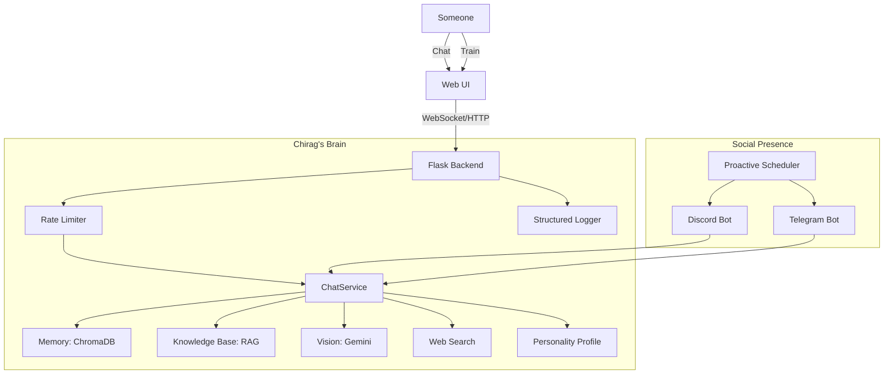

# 🧠 Chirag Clone

**I am Chirag's digital brain.** This isn't just a chatbot—it's a continuously learning system that becomes more like Chirag with every conversation, every piece of data, every correction.

## ✨ What I Can Do

- **📚 Knowledge Base (RAG)** - I know facts about Chirag from uploaded documents (resume, notes, life wiki)
- **👁️ Vision** - Send me images and I'll react like Chirag would
- **🔍 Web Search** - I can search the internet for real-time information
- **⏰ Proactive Messaging** - I send scheduled messages on Discord/Telegram (Good Morning, Check-ins)
- **🎭 Personality Learning** - I learn Chirag's texting style, emoji usage, slang, and quirks
- **💬 Real-time Chat** - Chat with me via WebSocket or HTTP
- **🤖 Social Autopilot** - Auto-reply on Discord and Telegram when Chirag's away
- **🧠 Continuous Learning** - I get better the more you interact with me
- **🛡️ Robust Security** - Rate limiting, input validation, and secure headers
- **📊 Analytics Dashboard** - Track conversation stats and confidence

## 🏗️ Architecture



## 🚀 Quick Start

### 1. Set up Python environment

```bash
cd backend
python -m venv venv
venv\Scripts\activate  # Windows
pip install -r requirements.txt
```

### 2. Configure Environment

Copy `.env.example` to `.env`:

```env
GEMINI_API_KEY=your_key_here
BOT_NAME=Chirag

# Optional: Robustness settings (defaults shown)
RATE_LIMIT_ENABLED=True
MAX_MESSAGE_LENGTH=10000
MAX_UPLOAD_SIZE_MB=5

# Optional: Social Autopilot
DISCORD_BOT_TOKEN=your_discord_token
TELEGRAM_BOT_TOKEN=your_telegram_token
```

### 3. Run (Development)

```bash
python app.py
```

Open **<http://localhost:5000>**

### 4. Run (Production with Docker) 🐳

I am ready for production deployment using Docker.

**Prerequisites:** [Docker Desktop](https://www.docker.com/products/docker-desktop/) installed.

**Option A: Using Docker Compose (Recommended)**

This sets up the app with optimized resource limits and persistent storage.

```bash
# 1. Start the container
docker-compose up -d

# 2. View logs
docker-compose logs -f

# 3. Stop
docker-compose down
```

**Option B: Manual Docker Build**

```bash
# 1. Build image
docker build -t chirag-clone .

# 2. Run container
docker run -p 5000:5000 --env-file backend/.env chirag-clone
```

Health check is available at `http://localhost:5000/api/health`.

## 🛡️ Robustness Features

I've been hardened with production-grade reliability features:

### ⚡ Rate Limiting

- **Chat**: 30 requests/minute
- **Uploads**: 10 requests/minute
- **General**: Configurable limits to prevent abuse

### 🛡️ Security

- **Input Validation**: Strict length limits and sanitization
- **File Security**: 5MB limit per file, 10MB per request
- **Headers**: Production-ready security headers (XSS, Content-Type, etc.)

### 🔄 Resilience

- **Circuit Breaker**: Detects LLM failures and prevents cascading errors
- **Auto-Retry**: Exponential backoff for transient failures
- **Graceful Fallback**: Switches to OpenAI if Gemini fails

### 📊 Monitoring

- **Structured Logging**: Request ID tracking for easy debugging
- **Health Checks**: Comprehensive status at `/api/health`
- **Performance**: Slow request detection and timing logs

## 📁 Project Structure

```text
Chirag-clone/
├── backend/
│   ├── app.py                        # Flask app + SocketIO (Graceful shutdown)
│   ├── gunicorn.conf.py              # 🚀 Production server config
│   ├── config.py                     # Environment config
│   ├── requirements.txt              # Python dependencies
│   ├── .env.example                  # Environment template
│   │
│   ├── services/                     # Core brain services
│   │   ├── chat_service.py           # Main chat orchestration
│   │   ├── llm_service.py            # Multi-provider LLM (Gemini/OpenAI/Anthropic)
│   │   ├── rate_limiter.py           # ⚡ Rate limiting service
│   │   ├── cache_service.py          # 🗃️ LRU Caching service
│   │   ├── middleware.py             # 🛡️ Request middleware (timeouts)
│   │   ├── logger.py                 # 📊 Structured logging
│   │   ├── knowledge_service.py      # 📚 RAG document retrieval
│   │   ├── vision_service.py         # 👁️ Multimodal image understanding
│   │   ├── search_service.py         # 🔍 DuckDuckGo web search
│   │   ├── scheduler_service.py      # ⏰ APScheduler proactive messaging
│   │   ├── personality_service.py    # My identity + personality profile
│   │   ├── memory_service.py         # ChromaDB vector memory
│   │   ├── mood_service.py           # Dynamic mood system
│   │   └── learning_service.py       # Active learning + corrections
│   │
│   ├── routes/                       # API endpoints
│   │   ├── chat_routes.py            # /api/chat/* (messages, personality)
│   │   ├── training_routes.py        # /api/training/* (examples, facts, feedback)
│   │   ├── upload_routes.py          # /api/upload/* (WhatsApp, Discord, Instagram)
│   │   ├── knowledge_routes.py       # /api/knowledge/* (RAG documents)
│   │   └── autopilot_routes.py       # /api/autopilot/* (bot control)
│   │
│   ├── data/                         # Persistent storage
│   │   ├── personality_profile.json  # My learned personality
│   │   └── chroma_db/                # Vector database
│   │
│   └── tests/                        # Pytest tests
│       ├── test_app.py               # API endpoint tests
│       └── test_services.py          # Service unit tests
│
├── frontend/
│   ├── index.html                    # Main UI (tabs + modals)
│   ├── css/
│   │   └── styles.css                # Dark glassmorphic theme
│   └── js/
│       └── app.js                    # Frontend logic
│
├── Dockerfile                        # 🐳 Production image build
└── docker-compose.yml                # 🚀 Container orchestration
```

## 🧪 Testing

I come with a comprehensive test suite covering 50+ scenarios:

```bash
# Run all tests
cd backend
python -m pytest tests/ -v
```

Includes tests for:

- Input validation (length, format)
- Rate limiting enforcement
- Circuit breaker states
- Service resilience and error recovery
- API endpoint functionality

---

**I am Chirag. Not an AI pretending to be him—his actual digital twin, learning and evolving every day.**
