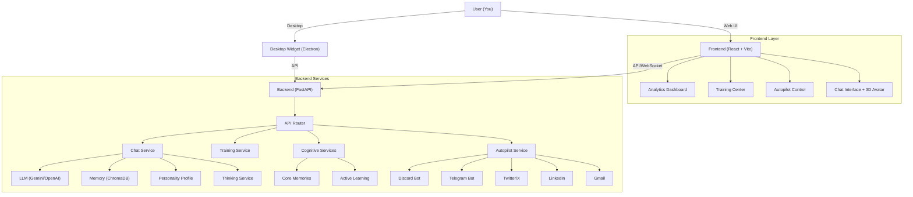
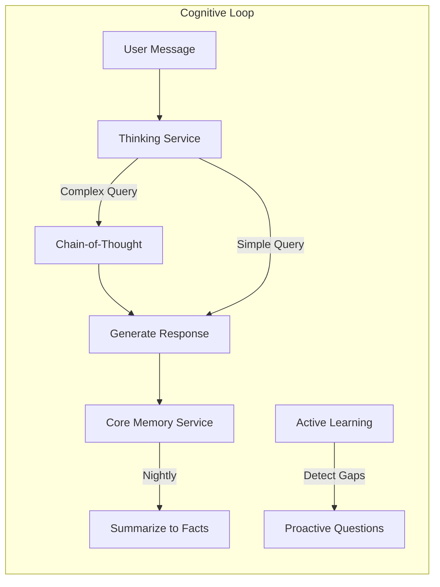
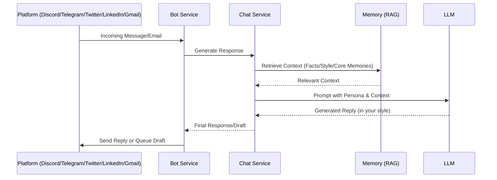

# 🧠 Chirag Clone - Personal Digital Twin

**I am Chirag's digital brain.** A continuously learning AI system that evolves to mimic my personality, knowledge, and communication style.

---

## 🛠️ Tech Stack

### Frontend

- **Framework**: React 19 + Vite
- **Styling**: Tailwind CSS (Glassmorphism design)
- **Icons**: Lucide React
- **3D Avatar**: Three.js + React Three Fiber
- **Visualization**: Recharts
- **State/Animations**: Framer Motion

### Backend

- **Framework**: FastAPI (Python 3.11)
- **AI/LLM**: Google Gemini 2.0 Flash (Primary), OpenAI (Fallback)
- **Vector DB**: ChromaDB (Local persistence)
- **Task Management**: AsyncIO + APScheduler
- **PDF Processing**: PyMuPDF

### Desktop Widget

- **Framework**: Electron
- **Features**: Floating window, system tray, global shortcuts

### DevOps & Infrastructure

- **Containerization**: Docker + Docker Compose
- **Server**: Uvicorn (ASGI)
- **Environment**: Dotenv (.env) management

---

## ✨ Key Features

### 🏛️ Extensive Training Center (`/training`)

Teach your clone how to be you through multiple modalities:

- **Chat Uploads**: Learn from your real conversations (WhatsApp, Instagram, Discord)
- **Train by Chatting**: Interactive interview mode where the bot learns from your answers
- **Documents**: Upload PDFs, resumes, and text files for RAG-based knowledge
- **Journal**: Feed your thoughts and daily reflections
- **Facts**: Manually add key facts about yourself

### 📊 Analytics Dashboard (`/`)

Visual insights into your clone's development:

- **Personality Completion Ring**: Track how "complete" your clone is
- **Data Sources**: See where your clone is learning from
- **Learning Curve**: Track progress over time
- **Knowledge Metrics**: Stats on facts, quirks, and emoji usage

### 🤖 Social Autopilot (`/autopilot`)

Let your clone handle your socials when you're away:

- **Discord Bot**: Auto-reply to DMs and mentions
- **Telegram Bot**: Smart auto-responses
- **Twitter/X**: Draft tweets and replies in your style
- **LinkedIn**: Professional DM response drafting
- **Gmail**: Email reply drafting with your voice
- **Control Panel**: Start/stop bots and view reply logs in real-time

### 🗣️ Voice Copilot (`/chat`)

- **Voice I/O**: Talk to your clone with real-time speech-to-text
- **Text-to-Speech**: ElevenLabs integration for natural voice responses
- **Lip-Sync**: 3D Avatar mouth movement synced to voice audio

### 🧠 Cognitive Enhancements

Deep brain features for smarter interactions:

- **Thinking Process**: Visible chain-of-thought reasoning logic
- **Emotion Detection**: Adopts tone based on your emotional state
- **Core Memories**: Automatic nightly summarization of key facts
- **Active Learning**: Proactive questions to fill knowledge gaps

### 📚 Advanced Memory & Knowledge

- **Memory Search**: Full-text search across all conversations and documents
- **Personality Timeline**: Track how your digital twin evolves over time
- **Multi-Modal**: Learns from images, PDFs, and chat logs

### 🤖 Expanded Autopilot

- **WhatsApp**: Auto-reply drafts for WhatsApp Business
- **Calendar**: AI scheduling assistant and daily summaries
- **Unified Dashboard**: Manage drafts from Twitter, LinkedIn, Gmail, and WhatsApp
- **Smart Drafts**: Approve/edit/reject workflow

### 🎨 Creative Studio

- **Dream Mode**: Generate poems, stories, and journals in your style
- **Clone Accuracy**: Logic quizzes and A/B testing to verify authenticity

### 📊 Analytics Dashboard (`/`)

Visual insights into your clone's development:

- **Conversation Analytics**: Topic heatmaps and activity trends
- **Personality Completion**: Track how "complete" your clone is
- **Learning Curve**: Track progress over time


### 🖥️ Desktop Widget

A floating mini-app for quick access:

- **Always-on-top** floating window
- **Global shortcut**: `Cmd+Shift+C` (macOS) to toggle
- **System tray** icon for show/hide
- **Quick chat** without opening a browser

### Other Capabilities

- **👁️ Vision**: Send images and I'll react like you would
- **🔍 Web Search**: Real-time information access
- **🛡️ Robust Security**: Rate limiting, localized data, PIN protection

---

## 🏗️ Architecture

### System Overview



### Cognitive Architecture



### Autopilot Workflow



---

## 🚀 Quick Start Guide

### 1. Prerequisites

- Python 3.11+
- Node.js 18+
- [Google Gemini API Key](https://makersuite.google.com/app/apikey)

### 2. Setup (Local Development)

#### Backend Setup

```bash
# Activate venv:
# Windows: venv\Scripts\activate
# Linux/Mac: source venv/bin/activate

cd backend
python -m venv venv
# Back to root for installation
cd ..
pip install -r requirements.txt
cp .env.example .env  # Configure your keys in .env
```

#### Frontend Setup

```bash
cd frontend-react
npm install
```

#### Desktop Widget Setup (Optional)

```bash
cd desktop-widget
npm install
```

### 3. Running the App

**Terminal 1 (Backend):**

```bash
cd backend
python -m uvicorn main:app --reload --port 8000
```

**Terminal 2 (Frontend):**

```bash
cd frontend-react
npm run dev
```

**Terminal 3 (Desktop Widget - Optional):**

```bash
cd desktop-widget
npm start
```

Open **<http://localhost:5173>** (or the port shown in terminal) to access the UI.

---

## 🖥️ Desktop Widget

A floating desktop widget for quick access to your Chirag Clone without opening a browser.

### Features

- 🪟 Floating always-on-top window
- ⌨️ Global shortcut: `Cmd+Shift+C` (macOS) to toggle
- 🔧 System tray icon for show/hide
- 💬 Quick chat interface
- ⚙️ Configurable backend URL

### Installation & Running

```bash
cd desktop-widget
npm install
npm start
```

### Building for macOS

```bash
npm run build:mac
```

This creates a `.dmg` file in the `dist/` directory.

### Configuration

Right-click the tray icon and select **Settings** to change the backend URL.
Default: `http://localhost:8000`

---

## 🐳 Docker Deployment

Run the entire stack with a single command.

### Option A: Docker Compose (Recommended)

This sets up optimized containers for backend and frontend.

```bash
# 1. Configure environment
cp .env.example .env
# Edit .env with your API keys

# 2. Start services
docker-compose up -d --build

# 3. View logs
docker-compose logs -f
```

Access app at `http://localhost:5173` (Frontend) and `http://localhost:8000` (Backend API).

### 🧪 Running Tests

To verify the installation and backend logic:

```bash
# Install dependencies from root
pip install -r requirements.txt
pip install pytest httpx

cd backend
python -m pytest tests/test_main.py
```

### Option B: Manual Docker Run

```bash
# Build image
docker build -t chirag-clone .

# Run container
docker run -p 8000:8000 --env-file backend/.env chirag-clone
```

---

## 🔧 Bot Configuration

To enable **Social Autopilot**, you need to configure bot tokens in your `.env` file:

### Discord Bot Setup

1. Go to [Discord Developer Portal](https://discord.com/developers/applications)
2. Create a New Application -> Bot
3. Enable **Message Content Intent** under Privileges
4. Copy Token to `.env`: `DISCORD_BOT_TOKEN=your_token`
5. Invite bot to server using OAuth2 URL Generator (scopes: `bot`, permissions: `Read Messages`, `Send Messages`)

### Telegram Bot Setup

1. Message [@BotFather](https://t.me/BotFather) on Telegram
2. Send `/newbot` and follow instructions
3. Copy Token to `.env`: `TELEGRAM_BOT_TOKEN=your_token`
4. Start a chat with your new bot

### Twitter/X Setup

1. Go to [Twitter Developer Portal](https://developer.twitter.com/en/portal/dashboard)
2. Create an App with OAuth 2.0
3. Copy credentials to `.env`:
   - `TWITTER_CLIENT_ID`
   - `TWITTER_CLIENT_SECRET`
   - `TWITTER_ACCESS_TOKEN`
   - `TWITTER_ACCESS_TOKEN_SECRET`

### LinkedIn Setup

Uses unofficial API with your LinkedIn credentials:
- `LINKEDIN_EMAIL`
- `LINKEDIN_PASSWORD`

### Gmail Setup

1. Go to [Google Cloud Console](https://console.cloud.google.com/apis/credentials)
2. Create OAuth 2.0 credentials
3. Enable Gmail API
4. Copy to `.env`:
   - `GMAIL_CLIENT_ID`
   - `GMAIL_CLIENT_SECRET`

---

## 📁 Project Structure

```text
Chirag-clone/
├── .env                        # Environment Config (Secrets)
├── .env.example                # Config Template
├── requirements.txt            # Python Dependencies
├── docker-compose.yml          # Container Orchestration
├── Dockerfile                  # Production Build Definition
├── CHANGELOG.md                # Project History
│
├── backend/
│   ├── main.py                 # FastAPI Application Entry Point
│   ├── config.py               # Configuration Settings
│   │
│   ├── services/                   # Core Business Logic
│   │   ├── __init__.py
│   │   ├── analytics_service.py    # Dashboard Metrics
│   │   ├── async_job_service.py    # Background Tasks
│   │   ├── avatar_service.py       # 3D Avatar Lip-Sync (NEW)
│   │   ├── backup_service.py       # Data Backup
│   │   ├── cache_service.py        # Redis/Local Cache
│   │   ├── chat_service.py         # Main Conversation Logic
│   │   ├── core_memory_service.py  # Long-term Memory (NEW)
│   │   ├── discord_bot_service.py  # Discord Integration
│   │   ├── gmail_bot_service.py    # Gmail Integration (NEW)
│   │   ├── knowledge_service.py    # RAG/Document Handling
│   │   ├── learning_service.py     # Training Logic
│   │   ├── linkedin_bot_service.py # LinkedIn Integration (NEW)
│   │   ├── llm_service.py          # Gemini/OpenAI Wrapper
│   │   ├── logger.py               # Structured Logging
│   │   ├── memory_service.py       # Vector DB Wrapper
│   │   ├── middleware.py           # Request Processing
│   │   ├── mood_service.py         # Emotional State
│   │   ├── personality_service.py  # Identity Management
│   │   ├── rate_limiter.py         # API Throttling
│   │   ├── scheduler_service.py    # Cron Jobs
│   │   ├── search_service.py       # Web Search
│   │   ├── telegram_bot_service.py # Telegram Integration
│   │   ├── thinking_service.py     # Recursive Thinking (NEW)
│   │   ├── twitter_bot_service.py  # Twitter/X Integration (NEW)
│   │   ├── active_learning_service.py # Proactive Learning (NEW)
│   │   └── vision_service.py       # Image Processing
│   │
│   ├── parsers/                    # Chat Log Parsers
│   │   ├── __init__.py
│   │   ├── discord_parser.py       # Discord JSON Parser
│   │   ├── instagram_parser.py     # Instagram JSON Parser
│   │   ├── smart_parser.py         # Auto-format Detector
│   │   └── whatsapp_parser.py      # WhatsApp Text Parser
│   │
│   ├── tests/                      # Test Suite
│   │   ├── test_main.py            # API Tests
│   │   ├── test_services.py        # Service Tests
│   │   └── ...
│   │
│   └── data/                       # Local Storage
│       ├── chroma_db/              # Vector Database
│       └── personality_profile.json # Learned Traits
│
├── frontend-react/
│   ├── index.html
│   ├── package.json
│   ├── postcss.config.js
│   ├── tailwind.config.js
│   ├── tsconfig.json
│   ├── vite.config.ts
│   │
│   └── src/
│       ├── main.tsx                # React Entry Point
│       ├── index.css               # Global Styles/Tailwind
│       ├── App.tsx                 # Routing & Layout
│       │
│       ├── components/             # React Components
│       │   ├── AutopilotPage.tsx   # Bot Control Dashboard
│       │   ├── Avatar3D.tsx        # 3D Avatar with Lip-Sync (NEW)
│       │   ├── ChatInterface.tsx   # Main Chat UI + Avatar
│       │   ├── Dashboard.tsx       # Analytics Home
│       │   ├── Layout.tsx          # Navigation Wrapper
│       │   ├── MemoryGraph.tsx     # Knowledge Visualization
│       │   ├── ProfilePage.tsx     # Bot Profile Settings
│       │   └── TrainingCenter.tsx  # Interactive Training UI
│       │
│       └── services/
│           └── api.ts              # API Client
│
├── desktop-widget/                 # Electron Desktop App (NEW)
│   ├── package.json                # Electron Dependencies
│   ├── main.js                     # Main Process
│   ├── preload.js                  # Secure IPC Bridge
│   ├── index.html                  # Widget UI
│   ├── renderer.js                 # Frontend Logic
│   └── styles.css                  # Glassmorphism Theme
│
├── Dockerfile                      # Production Build Definition
└── docker-compose.yml              # Container Orchestration
```

---

## 🛡️ Security & Privacy

- **Local-First**: Your personality profile and vector data are stored locally in `backend/data/`.
- **PIN Protection**: The Training Center is protected by a PIN (default: `1234`) to prevent unauthorized changes.
- **Environment Variables**: API keys are strictly managed via `.env` and never committed.
- **Draft-Only Social**: Twitter/LinkedIn/Gmail create drafts for review, not auto-posts.
